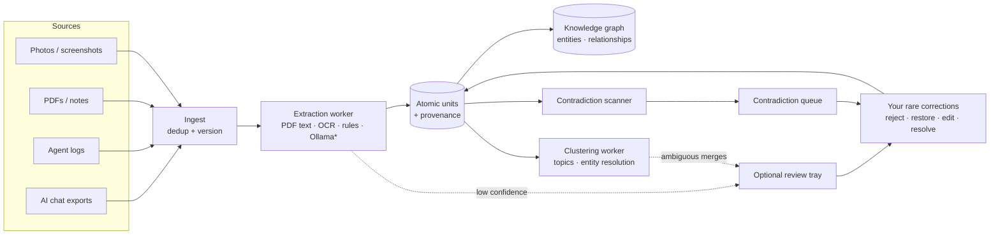

# Gather

**A local-first, privacy-first personal knowledge engine.** Point Gather at everything you've
accumulated — AI chat exports, agent session logs, PDFs, notes, screenshots, photos — and it
builds a private, searchable "brain" out of it: it extracts timestamped facts, claims and
decisions with full provenance, links them into a knowledge graph, groups related material,
resolves duplicate entities, and continuously surfaces **contradictions** across sources,
models and time.

It is designed to run **entirely offline**. The daemon never initiates an outbound connection;
every API binds to loopback; the optional local LLM (Ollama) and the optional encrypted VPS
backup are strictly opt-in.

> **Status:** active development, pre-1.0. The core pipeline (ingest → extract → graph →
> contradictions → autonomous organization) is implemented and CI-tested. See
> [Roadmap](#roadmap).

---

## Contents

- [Why Gather](#why-gather)
- [Features](#features)
- [How it works](#how-it-works)
- [Install](#install)
- [Quickstart](#quickstart)
- [Using Gather](#using-gather)
- [Configuration](#configuration)
- [Architecture](#architecture)
- [Development](#development)
- [Documentation](#documentation)
- [Privacy & security model](#privacy--security-model)
- [Roadmap](#roadmap)
- [License](#license)

---

## Why Gather

Your knowledge is scattered across a dozen AI assistants, agent logs and folders of documents,
and none of it talks to the rest. Worse, it quietly disagrees with itself — a budget you
mentioned in March, a different one in July; a tool you "decided on" twice. Gather's goal is
to let you **drop everything in and have the system do the organizing**, with human
involvement reserved for the rare, precise correction ("this fact is wrong", "keep this
photo out") rather than reviewing thousands of suggestions.

## Features

**Ingestion**
- Chat exports from **ChatGPT, Claude, Gemini, Grok, Perplexity, Copilot**, plus a generic
  JSON adapter
- Agent / session logs (JSONL)
- Files: **PDF** (text extraction), **Markdown / text**, **images** (EXIF + Tesseract OCR)
- Content-hash deduplication and versioning — re-importing the same export is idempotent

**Understanding**
- **Atomic-unit extraction**: facts, claims, decisions, preferences and events, each with a
  confidence score, temporal validity and a provenance anchor back to the exact source span
- Deterministic, offline **rule-based extractor** (always on) plus an opt-in **local LLM**
  (Ollama) extractor and embeddings
- **Knowledge graph** of entities and typed relationships, with bounded, cycle-safe traversal
- **Entity resolution** — aliases, merge suggestions, and merges that can be undone exactly

**Autonomous organization** (see [docs/AUTONOMOUS-PIPELINE.md](docs/AUTONOMOUS-PIPELINE.md))
- **Act, then allow undo**: high-confidence work is applied automatically; only the thin,
  ambiguous middle is parked in an *optional* review tray
- **Clustering**: duplicate entities are auto-merged conservatively, one decision per group;
  units are grouped into **topics** (mutual-kNN graph + connected components)
- **Feedback loop**: reject / restore / confirm / edit any unit; every correction is recorded
  and reversible, and drives a real-data precision metric
- **Active learning**: the tray is ordered by information gain, and your verdicts move the
  decision thresholds automatically (bounded, audited, resettable)
- **Photos**: near-duplicates grouped by perceptual hash (sharpest copy on top), albums from
  EXIF time and place, and optional local vision captions for visual topics. Nothing is deleted

**Contradictions**
- Background scanner detects conflicts (numeric mismatch, negation, exclusive assignment,
  antonyms), scores them, and queues them for resolution with a full audit trail

**Interfaces**
- **REST** API (`127.0.0.1:7601/api/v1`) and an equivalent **gRPC** API (`127.0.0.1:7602`)
- **Desktop app** (Tauri v2 + React) with drag-and-drop upload, a Library to browse and
  search everything stored, an interactive graph of how people, things and files connect,
  the optional review tray
  (keyboard-driven, with undo), topic and photo browsers, contradiction review, entity
  management and a view of what the auto-tuner learned
- Full-store **export / import** bundle for backup, migration and replication

**Operations**
- Prometheus metrics + a provisioned Grafana dashboard
- Scheduled, encrypted backups (OS-level scripts) and restore drills
- Quality gates in CI: extraction golden corpus, decision-policy and clustering evals

## How it works



\* Ollama is optional and loopback-only. Everything else runs offline with no model at all.

All state lives in **PostgreSQL 16 + pgvector**. Background workers (extraction, contradiction
scanning, clustering) run inside the daemon on configurable intervals and claim work with
`FOR UPDATE SKIP LOCKED`, so they are safe to run concurrently.

## Install

Download the installer for Windows, macOS or Linux from the
[releases page](https://github.com/joeydd032995-pixel/Gather/releases) and open it. It
includes everything: the app, the daemon, and a private PostgreSQL + pgvector database, set up
automatically on first launch and running on your machine only. The installers aren't
code-signed yet, so the first launch needs one extra click;
[docs/INSTALL.md](docs/INSTALL.md) walks through it for each system.

## Quickstart

The quickstart is for running from source (developers and servers).

**Prerequisites:** Docker + Docker Compose v2. For the desktop app: Rust (stable) and
Node 22.12+ (or 20.19+).

```bash
git clone https://github.com/joeydd032995-pixel/Gather.git && cd Gather

# 1. Configure — one required secret
cp .env.example .env
sed -i "s/^POSTGRES_PASSWORD=.*/POSTGRES_PASSWORD=$(openssl rand -hex 24)/" .env

# 2. Start the daemon + Postgres/pgvector
docker compose up --build -d

# 3. Check it's ready (verifies the DB and pgvector)
curl -s http://127.0.0.1:7601/readyz
```

Optional extras:

```bash
# Prometheus + Grafana (dashboard at http://127.0.0.1:3000)
docker compose --profile observability up -d

# Desktop app (dev mode)
cd apps/desktop && npm install && npm run tauri -- dev
```

For the full guided walkthrough — Phase-0 validation, desktop packaging, dashboards and the
optional backup VPS — see
[§10 of the technical write-up](docs/TECHNICAL-WRITEUP.md#10-what-to-run-first-quickstart).

## Using Gather

All examples assume the default open-on-loopback dev mode. If you set `GATHER_API_TOKEN`
(recommended), add `-H "Authorization: Bearer $GATHER_API_TOKEN"`.

```bash
API=http://127.0.0.1:7601/api/v1

# Ingest a ChatGPT export (conversations.json)
jq -n --slurpfile d conversations.json '{platform:"chatgpt", data:$d[0]}' \
  | curl -s -X POST $API/ingest/chat-export -H 'content-type: application/json' -d @-

# Upload documents and photos (multipart; any number of files)
curl -s -X POST $API/ingest/files -F file=@notes.md -F file=@paper.pdf -F file=@whiteboard.jpg

# Browse what was extracted
curl -s "$API/atomic-units?kind=decision&limit=20"

# Search (full-text by default; semantic when Ollama embeddings are enabled)
curl -s -X POST $API/search/semantic -H 'content-type: application/json' \
  -d '{"text":"backup target","limit":10}'

# Explore the graph around an entity
curl -s "$API/entities/<entity-id>/graph?depth=2"

# Topic clusters and the optional review tray
curl -s "$API/clusters?kind=topic"
curl -s "$API/review"

# Correct the brain: reject a wrong fact (reversible), or fix its wording
curl -s -X POST  $API/units/<unit-id>/reject
curl -s -X PATCH $API/units/<unit-id> -H 'content-type: application/json' \
  -d '{"statement":"The backup target is Hetzner CX22"}'

# Review and resolve contradictions
curl -s "$API/contradictions?status=open"
curl -s -X POST $API/contradictions/<id>/resolve -H 'content-type: application/json' \
  -d '{"resolution":"resolved_a","note":"the newer figure is right"}'

# Back up / restore the whole store
curl -s $API/export -o gather-bundle.ndjson
curl -s -X POST $API/import --data-binary @gather-bundle.ndjson
```

The complete endpoint reference (REST and gRPC) is in **[docs/API.md](docs/API.md)**.

## Configuration

Everything is configured through environment variables; `.env.example` documents the ones the
Docker stack reads. Key settings:

| Variable | Default | Purpose |
|---|---|---|
| `POSTGRES_PASSWORD` | — | **Required.** Database password |
| `GATHER_API_TOKEN` | *(empty)* | Bearer token for `/api/v1` and gRPC; empty = open on loopback |
| `GATHER_AUTH_MODE` | `env` | `env` or `keychain` (OS keychain, the desktop default) |
| `GATHER_OLLAMA_URL` | *(empty)* | Enable local LLM extraction + embeddings (loopback only) |
| `GATHER_ADMIT_HOLD_BELOW` | `0.5` | Units below this confidence are parked for optional review |
| `GATHER_CLUSTER_ENABLED` | `true` | Entity auto-resolution + topic grouping |
| `GATHER_RATE_LIMIT_RPS` | `50` | Global request-rate limit (0 disables) |

The complete reference — every variable, default, valid range and effect — is in
**[docs/CONFIGURATION.md](docs/CONFIGURATION.md)**.

## Architecture

| Layer | Technology |
|---|---|
| Daemon | Rust · Axum (REST) · tonic (gRPC) · sqlx · tokio |
| Storage | PostgreSQL 16 + pgvector (HNSW indexes), versioned migrations |
| Extraction | pdf-extract / lopdf · Tesseract OCR · EXIF · regex rules · optional Ollama |
| Desktop | Tauri v2 · React 19 · TypeScript · Vite |
| Ops | Docker Compose · Prometheus · Grafana · GitHub Actions · optional Terraform (Hetzner) |

### Repository layout

| Path | Contents |
|---|---|
| `daemon/src/routes/` | REST handlers (ingest, query, entities, contradictions, feedback, clusters, export) |
| `daemon/src/grpc/` | gRPC services sharing the same core functions as REST |
| `daemon/src/adapters/` | Per-platform chat-export parsers |
| `daemon/src/extract/` | Extraction worker: PDF, OCR, rule-based and LLM unit extraction, persistence |
| `daemon/src/scan/` | Contradiction scanner and scoring rules |
| `daemon/src/entities/` | Entity resolution: similarity, merge suggestions, merges |
| `daemon/src/decide/` | Auto-act decision policy (confidence bands, conservative merge gate) |
| `daemon/src/cluster/` | Mutual-kNN clustering primitive and clustering worker |
| `daemon/migrations/` | SQL schema, applied automatically at startup |
| `daemon/tests/` | Integration tests (vs pgvector) and offline quality evals |
| `proto/gather/v1/` | gRPC contract |
| `apps/desktop/` | Tauri v2 + React desktop app |
| `docker/`, `docker-compose.yml` | Local stack (+ optional observability profile) |
| `observability/` | Prometheus scrape config + Grafana dashboard |
| `scripts/` | Backup, restore-drill, benchmark and quality-sampling tooling |
| `infra/terraform/` | Optional hardened Hetzner backup VM |
| `docs/` | Specification, runbooks and references |

## Development

```bash
# Start a pgvector database for integration tests
docker compose up -d postgres
export DATABASE_URL=postgres://gather:<POSTGRES_PASSWORD>@127.0.0.1:5432/gather

cd daemon
cargo fmt --check
cargo clippy --all-targets -- -D warnings
cargo test                       # integration tests run when DATABASE_URL is set
cargo run                        # run the daemon locally (reads the same env vars)

cd ../apps/desktop
npm install
npm run build                    # tsc + vite build
npm run tauri -- dev             # desktop app against the local daemon
```

**Quality gates.** Besides unit and integration tests, CI runs offline evals that fail the
build on regressions: the extraction golden corpus (`tests/extraction_quality.rs`, precision
≥ 70%), the conservative decision policy (`tests/decision_policy.rs`) and clustering
(`tests/clustering.rs`). CI also runs a backup/restore round-trip drill, a graph-traversal
benchmark, `cargo audit` / `npm audit`, and builds the desktop app on Linux, Windows and macOS.

Migrations live in `daemon/migrations/` and are embedded into the binary; add a new numbered
file rather than editing an existing one. Constraints on large tables should be added
`NOT VALID` and validated in a *separate* migration.

## Documentation

| Document | What's in it |
|---|---|
| [docs/TECHNICAL-WRITEUP.md](docs/TECHNICAL-WRITEUP.md) | The full specification: architecture, DDL, extraction, contradiction algorithm, security model, phased plan |
| [docs/INSTALL.md](docs/INSTALL.md) | Installing the desktop app, first-launch warnings, where data lives, updates |
| [docs/RELEASING.md](docs/RELEASING.md) | Cutting a release, what the installer bundles, turning on code signing |
| [docs/API.md](docs/API.md) | REST and gRPC endpoint reference with examples |
| [docs/CONFIGURATION.md](docs/CONFIGURATION.md) | Every environment variable |
| [docs/AUTONOMOUS-PIPELINE.md](docs/AUTONOMOUS-PIPELINE.md) | How Gather organizes itself: confidence bands, feedback loop, clustering |
| [docs/BENCHMARK-RUNBOOK.md](docs/BENCHMARK-RUNBOOK.md) | Producing the go/no-go numbers: latency benchmark, quality evals |
| [docs/BACKUP-RUNBOOK.md](docs/BACKUP-RUNBOOK.md) | Scheduled encrypted backups and restore drills |
| [scripts/README.md](scripts/README.md) | The operational scripts |

## Privacy & security model

- **Offline by default.** The daemon opens only its loopback listeners and the Postgres
  connection. It never phones home; there is no telemetry.
- **Loopback only.** REST and gRPC bind to `127.0.0.1`; binding elsewhere requires an explicit
  `GATHER_ALLOW_NON_LOOPBACK=true`. The Ollama URL must also be loopback.
- **Authentication.** Set `GATHER_API_TOKEN` (or use `keychain` mode) to require a bearer
  token on every API call. Without one, the daemon logs a loud warning and serves unauthenticated
  on loopback only.
- **Rate limiting** protects against runaway local clients.
- **Your data, your corrections.** Every automatic action is reversible and audited; the full
  store — including your correction history — exports to a portable bundle.
- **Backups are opt-in** and encrypted before they leave the machine.
- **Updates are opt-in.** The desktop app checks for a new version only when you press
  **Check now** or turn on the start-up check in Settings. Builds that can update themselves
  verify each download against a key built into the app.

See §7 of the [technical write-up](docs/TECHNICAL-WRITEUP.md) for the full threat model.

## Roadmap

- **Done:** ingestion adapters, extraction, knowledge graph, contradiction scanning, entity
  resolution, gRPC parity, export/import, observability, backups, the autonomous-pipeline
  foundation (auto-act + feedback loop), clustering, and active learning (information-gain
  tray ordering + feedback-driven threshold auto-tuning), and the photo pipeline
  (perceptual-hash duplicate groups, EXIF albums, optional local vision captions), with a
  desktop review tray, group/photo browsers and a tuning view, gRPC parity for all of it, and
  exact entity unmerge (wrong auto-merges become tuning signal), and one-download installers
  for Windows, macOS and Linux (bundled daemon and PostgreSQL + pgvector, no Docker, opt-in
  update check).
- **Next:** code signing for the installers (the CI hooks are in place; see
  [docs/RELEASING.md](docs/RELEASING.md)). Gather stays a single-user, fully offline app.

## License

MIT (as declared in `daemon/Cargo.toml`).
